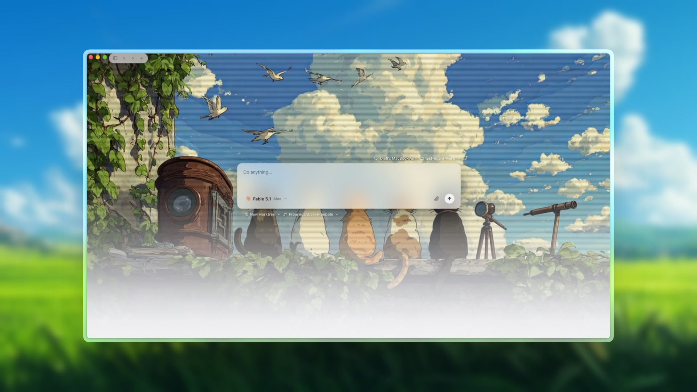
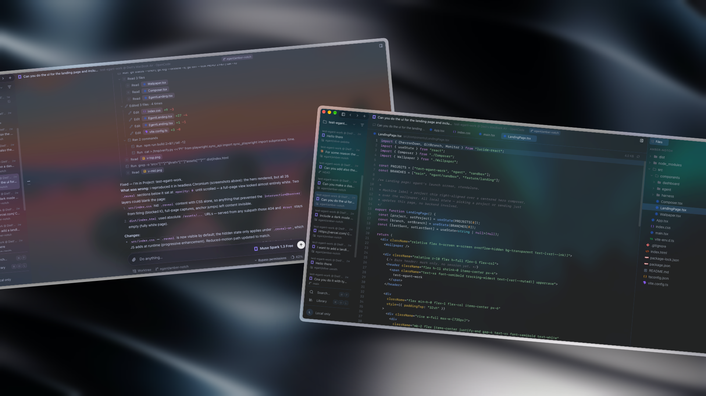
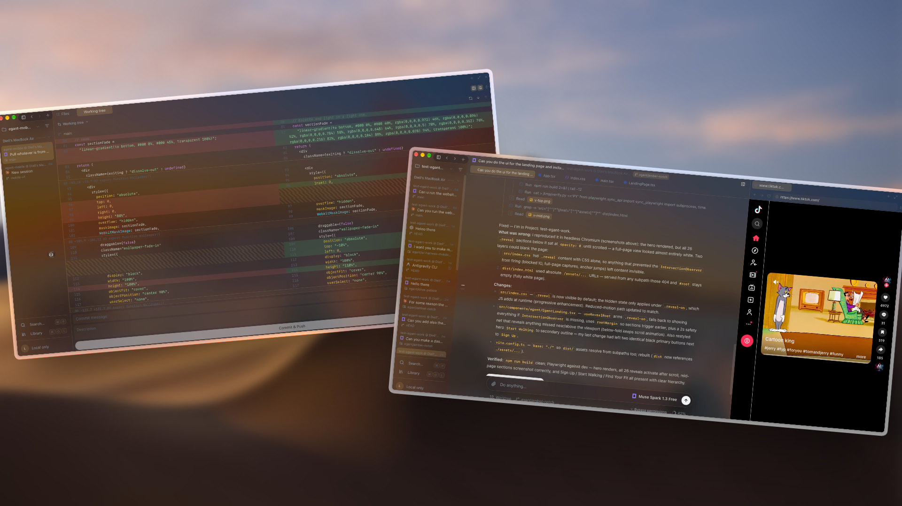
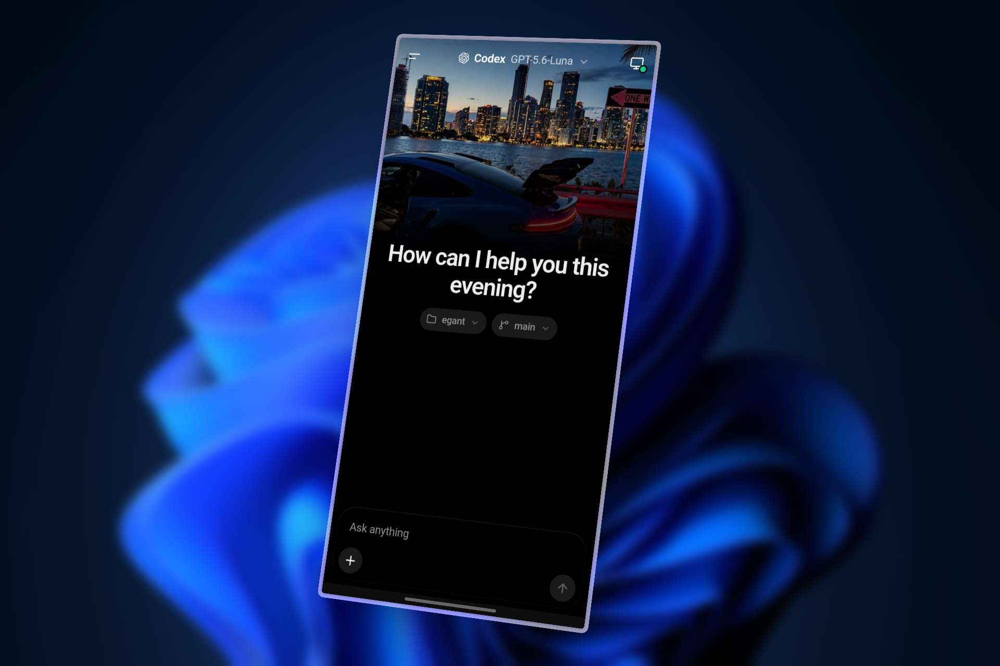

<h1 align="center">egant</h1>

<p align="center">
  <b>One native window for all your coding agents.</b><br>
  Claude Code, Codex, opencode and more — running in your real project folders,<br>
  with the files, diffs, terminals and git you need right beside the chat.
</p>

<p align="center">
  
</p>

## What is egant?

Coding agents live in terminals. That works, until you have five of them going across three projects and you want to see what they changed, review a diff, run the app, and pick up from your phone.

egant is a desktop app (Tauri: Rust + React) that wraps the agent CLIs you already have installed. You keep your own logins, your own `git`, your own `gh`. egant adds the workspace around them.

There is no egant account and no egant server. Everything runs on your machine.

## What you get

<table>
<tr>
<td width="50%" valign="top">

### Chat with any agent

Start a session from the launch screen, pick an agent and model, and talk. Replies stream in token by token, tool calls show up as cards, and a subagent's work nests under the task that launched it. Interrupt mid-turn, switch permission modes, and answer permission prompts and questions inline.

</td>
<td width="50%" valign="top">

### A workspace around the chat

Press `⌘J` for a panel with a file tree, git changes, pull requests and real terminals. Open files and diffs as tabs next to the conversation, with a syntax-highlighted editor and autosave.

</td>
</tr>
<tr>
<td valign="top">

### Isolated by default

Each session can start in its own **git worktree** on its own branch, so parallel agents never step on each other or on your checkout.

</td>
<td valign="top">

### Review and undo

See exactly what changed in a working-tree diff (unified or split), commit and push from the app, and **revert a turn** with per-turn snapshots when an agent goes the wrong way.

</td>
</tr>
<tr>
<td valign="top">

### Find anything

`⌘K` searches across conversations and jumps to the exact message. `@` mentions a file in the composer and `/` opens the command menu.

</td>
<td valign="top">

### One library for every agent

Add MCP servers and skills once in the **Library**. egant syncs them into each agent's own config, so you stop maintaining them per tool.

</td>
</tr>
</table>

<p align="center">
  <br>
  <sub>A conversation next to the editor, with the file tree in the panel.</sub>
</p>

<p align="center">
  <br>
  <sub>Review the working-tree diff, or preview the site the agent is building without leaving the window.</sub>
</p>

## Agents

egant finds the agent CLIs on your machine and shows which ones are logged in. It does not ship or proxy any model.

| Kind | Agents | How it runs |
|------|--------|-------------|
| **Chat** | Claude Code, Codex, opencode | A native transcript, composer, permissions and usage meter, driven over each agent's own protocol |
| **CLI** | Cursor, Devin, Grok, Hermes, Pi, Copilot, Goose, Qwen and others | The agent's full terminal UI in a real PTY on the stage |

Chat sessions get the full egant experience. CLI sessions give you the agent as-is, with egant's worktrees, panel and project handling around it.

## Your phone, too

<p align="center">
  
</p>

The desktop app serves a small web client you can open on your phone, over your Tailscale network. Pair it from Settings → Devices with a QR code. Start a chat, switch models, and follow a running session while you are away from your desk. The agents keep running on your computer; the phone is just another window onto it.

## Quickstart

You need Rust 1.85+, Node 20+, and at least one agent CLI on your `PATH` (for example `claude`, then `claude login`). Install `gh` if you want the Pull Requests section.

```bash
git clone https://github.com/Dielldev/egant.git
cd egant
npm install
npm run tauri dev
```

On macOS the Xcode Command Line Tools are enough (`xcode-select --install`). Linux needs WebKitGTK 4.1 and a few libraries; see [Linux setup](#linux-setup).

### Build and test

```bash
npm run tauri build                                # release bundle
npm run build                                      # type-check + frontend build
cargo test -p egant -p egant-harness -p egant-vcs  # Rust tests, no window needed
```

### Run a second copy

Vite uses port `1420` by default and fails loudly if it is taken. For another worktree:

```bash
npm run tauri:dev:1421
```

### Linux setup

<details>
<summary>Fedora</summary>

```bash
sudo dnf group install c-development
sudo dnf install webkit2gtk4.1-devel openssl-devel curl-devel wget file \
  libappindicator-gtk3-devel librsvg2-devel libxdo-devel gtk3-devel \
  dbus-devel pkgconf-pkg-config
```

If `cc` on your `PATH` is Zig's clang wrapper, point at the system compiler first: `export CC=/usr/bin/gcc CXX=/usr/bin/g++`.

</details>

<details>
<summary>Ubuntu / Debian</summary>

```bash
sudo apt update
sudo apt install libwebkit2gtk-4.1-dev build-essential curl wget file \
  libxdo-dev libssl-dev libayatana-appindicator3-dev librsvg2-dev \
  libdbus-1-dev pkg-config
```

</details>

## Shortcuts

| | macOS | Linux |
|---|---|---|
| New session | `⌘N` | `Ctrl+N` |
| Search conversations | `⌘K` | `Ctrl+K` |
| Focus composer | `⌘L` | `Ctrl+L` |
| Toggle sidebar | `⌘B` | `Ctrl+B` |
| Toggle workspace panel | `⌘J` | `Ctrl+J` |
| Interrupt the agent | `⌘⎋` | `Ctrl+Esc` |
| Send / newline | `⏎` / `⇧⏎` | `⏎` / `⇧⏎` |

## How it works

```
React (views only)  ⇄  Tauri IPC  ⇄  Rust backend (owns all state)
                                        ├─ harness crate → agent CLIs (one impl per agent)
                                        ├─ vcs crate     → git2 locally, your `git` for the network
                                        └─ PTYs for terminals, `gh` for pull requests
```

- **The backend owns state, the frontend owns pixels.** Rust holds the sessions and sends snapshots. React renders them.
- **Streaming is events.** Each turn becomes a small event per token instead of a full re-render.
- **Agents sit behind a trait.** Adding one is a new implementation in `crates/harness`, with no frontend change.
- **Git uses your setup.** Local status, diff and commit go through libgit2. Push, fetch and pull use your own `git`, so keychain, SSH agent and hooks just work.

```
src-tauri/   Tauri shell: state, commands, PTYs, settings
src/         React frontend
crates/
  harness/   agent backends and the transcript model
  vcs/       git, worktrees, file watching
mobile/      the phone client
```

## Settings and data

Settings, including the wallpaper and its dim level, live in `~/Library/Application Support/egant/settings.json` on macOS and `~/.config/egant/settings.json` on Linux. Worktrees are created under `~/.egant/worktrees/`.

## Troubleshooting

- **"Could not start the agent":** the agent CLI is not on `PATH`.
- **"OAuth session expired":** run `claude login` (or the equivalent for your agent).
- **Blank window in `tauri dev`:** Vite must be on the port Tauri points at. Free port `1420`, or use a second port as above.
- **Empty or black UI on macOS:** the window is transparent, so `body` must keep alpha-only backgrounds.
- **`dbus-1.pc` not found:** install `dbus-devel` and `pkgconf-pkg-config` (Fedora) or `libdbus-1-dev` and `pkg-config` (Ubuntu).

## License

MIT. See `Cargo.toml`.
